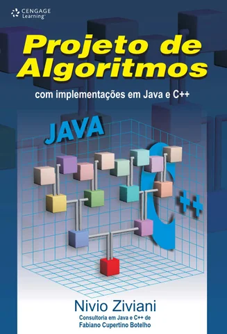
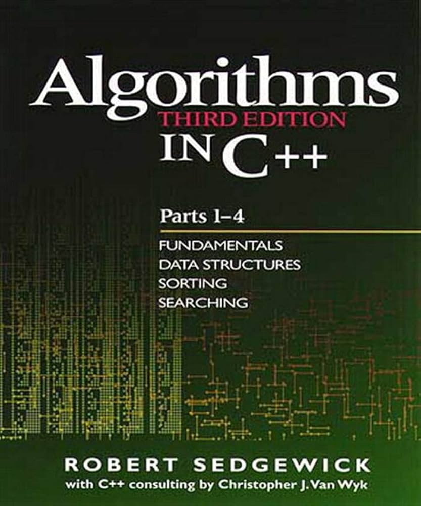
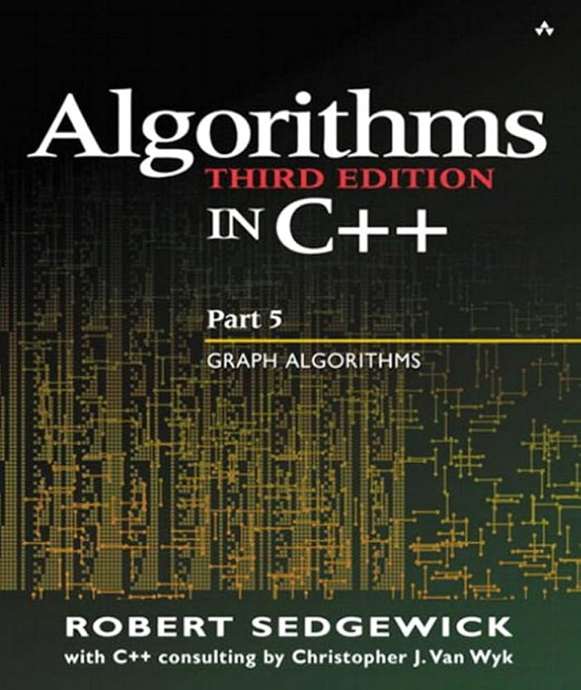

# DSA Repository


# Books I've used while learning DSA:

## Books

### Nivio Ziviani - Projeto de Algoritmos
<p align="center">
  
</p>

### Robert Sedgewick - Algorithms in C++

<p>
   
  
</p>


## Overview

This repository provides **Data Structures and Algorithms (DSA)** implementations, examples, and notes for C++. It is designed for students, developers, and competitive programmers to build a strong foundation in DSA, focusing on clarity, efficiency, and best practices.

## Motivation

Mastering DSA is crucial for:

- Academic success in computer science
- Technical interviews at leading tech companies
- Competitive programming and coding challenges
- Efficient software design and problem solving

This repository covers topics from fundamentals to advanced concepts, with explanations, code samples, and exercises.

## Contents (Quick Navigation)

- [Fundamental DSA Topics](#fundamental-dsa-topics)
- [Advanced Data Structures](#advanced-data-structures)
- [Advanced Algorithms](#advanced-algorithms)
- [Problem Solving](#problem-solving)
- [Complexity Analysis](#complexity-analysis)
- [Additional Concepts](#additional-concepts)
- [How to Use](#how-to-use)
- [Contributing](#contributing)
- [License](#license)

---

## Fundamental DSA Topics

- [ ] **Arrays & Strings**
  - [ ] Declaration, insertion, removal, iteration
  - [ ] Subarrays, subsegments, prefix sums
  - [ ] Palindromes, anagrams, string manipulation
- [ ] **Linked Lists**
  - [ ] Singly and Doubly Linked Lists
  - [ ] Insertion, removal, search, reversal
  - [ ] Cycle detection, list merging
- [ ] **Stacks & Queues**
  - [ ] Implementation with arrays and lists
  - [ ] Stacks for expressions and balanced parentheses
  - [ ] Queues and circular queues
- [ ] **Recursion & Backtracking**
  - [ ] Simple recursion: factorial, Fibonacci
  - [ ] Subset and permutation generation
- [ ] **Sorting & Searching**
  - [ ] Bubble, Selection, Insertion Sort
  - [ ] Linear Search, Binary Search
  - [ ] Merge Sort, Quick Sort, Counting Sort
  - [ ] Search in rotated arrays
- [ ] **Basic Trees**
  - [ ] Binary Tree, Binary Search Tree
  - [ ] Traversals: Preorder, Inorder, Postorder
  - [ ] Balanced trees (AVL, Red-Black)
- [ ] **Hash Tables**
  - [ ] Insertion, search, removal
  - [ ] Collision resolution (chaining)
  - [ ] Hash functions and performance
- [ ] **Complexity Analysis**
  - [ ] Time & Space Complexity, Big O, Θ, Ω
  - [ ] Recurrence relations, amortized analysis
- [ ] **Problem Solving**
  - [ ] Introductory exercises and programming challenges
  - [ ] Real-world applications and case studies

---

## Advanced Data Structures

- [ ] **Advanced Trees**
  - [ ] AVL, Red-Black, Segment Tree, Fenwick Tree
  - [ ] Advanced traversals
- [ ] **Graphs**
  - [ ] Representation: adjacency matrix/list
  - [ ] DFS, BFS, cycle detection
  - [ ] Shortest path algorithms: Dijkstra, Bellman-Ford, Floyd-Warshall
  - [ ] Minimum/Maximum Spanning Tree: Kruskal, Prim
  - [ ] Network Flow: Ford-Fulkerson, Edmonds-Karp
  - [ ] Graph coloring, topological sort, SCC, Eulerian Path/Circuit
- [ ] **Heaps & Priority Queues**
  - [ ] Min/Max Heap, heapify, heapsort
  - [ ] Fibonacci Heap, Pairing Heap
- [ ] **Advanced Linked Lists**
  - [ ] Circular, skip lists
- [ ] **Advanced Stacks & Queues**
  - [ ] Monotonic stacks, deque
- [ ] **Tries & String Matching**
  - [ ] Prefix tree, KMP, Rabin-Karp
  - [ ] Suffix Tree, Suffix Array, Heavy-Light Decomposition, Treap
- [ ] **Disjoint Set Union (DSU)**
  - [ ] Union by rank, path compression
  - [ ] Applications in graph algorithms
- [ ] **Persistent Data Structures**
  - [ ] Structure versioning

---

## Advanced Algorithms

- [ ] **Intermediate Sorting & Searching**
  - [ ] Advanced Merge Sort, Quick Sort, Counting Sort
  - [ ] Binary search variations, convex hull
- [ ] **Backtracking**
  - [ ] N-Queens, Sudoku solver, combinatorial generation
  - [ ] Optimized backtracking
- [ ] **Dynamic Programming**
  - [ ] Fibonacci, Climbing Stairs, 0/1 Knapsack
  - [ ] LCS, LIS, Matrix Chain Multiplication
  - [ ] DP on trees/graphs, Bitmask DP, multi-state DP
  - [ ] Convex hull trick, Knuth optimization
- [ ] **Greedy Algorithms**
  - [ ] Activity selection, interval scheduling, Huffman coding
  - [ ] Approximation algorithms
- [ ] **Bit Manipulation**
  - [ ] Bitwise operations, masks, XOR tricks
  - [ ] Subset generation, bitmasks in DP
- [ ] **Randomized & Approximation Algorithms**
  - [ ] Monte Carlo, Las Vegas, greedy approximation
- [ ] **Miscellaneous**
  - [ ] Computational geometry, number theory, combinatorics
  - [ ] Game Theory & Sprague-Grundy

---

## Problem Solving

- Competitive programming exercises
- Coding challenges from:
  - LeetCode, HackerRank, Codeforces, CodeChef
- Optimization problems
- Simulation and modeling

---

## Complexity Analysis

- Time & space complexity
- Big O, Θ, Ω
- Recurrence relations
- Amortized analysis
- Data structure trade-offs

---

## Additional Concepts

- Hashing & collision resolution
- Randomized algorithms
- Approximation algorithms
- Graph coloring & network flow
- Advanced topics:
  - Fibonacci heap
  - Suffix array/tree
  - Heavy-light decomposition

---

## How to Use

1. Clone the repository:

     ```bash
     git clone https://github.com/oenzoribas/DSA.git
     cd DSA
     ```

2. Navigate to your language folder:

     ```bash
     cd <language_folder>
     ```

3. Explore algorithms and run examples in your IDE or terminal.

---

## Contributing

Contributions are welcome! Please follow these steps:

1. Fork the repository.
2. Create a new branch:

     ```bash
     git checkout -b feature/your-feature
     ```

3. Commit your changes:

     ```bash
     git commit -m "Add some feature"
     ```

4. Push to your branch:

     ```bash
     git push origin feature/your-feature
     ```

5. Open a Pull Request with explanations and examples.

---

## License

This project is licensed under the MIT License. See the [LICENSE](LICENSE) file for details.
